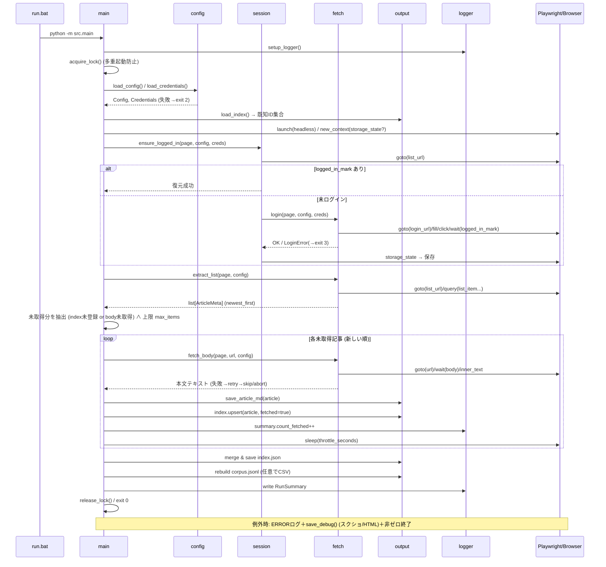

# Salon.JP Daily Fetcher 設計書（v1.0）

> 対象要件: `docs/requirements.md` v1.0（確定版）
> 種別: アーキテクチャ設計 + コンポーネント設計 + データモデル設計
> 作成日: 2026-06-02
> 注記: 本書はインターフェース契約（シグネチャと振る舞い）まで定義する。実関数の中身（実装）は `/sc:implement` で行う。

---

## 1. 設計概要

### 1.1 設計原則
- **特定サロン専用・直線処理**: 汎用エンジンを作らない（NFR-01）。`fetch.py` に対象サロン向けの処理を素直に書く。
- **壊れやすい値の外出し**: URL/CSSセレクタ/動作設定のみ `config.yaml`、秘密情報は `.env.local`（FR-13, NFR-03, NFR-08）。
- **冪等性**: 何度実行しても結果が壊れない。未取得分のみ取得し、`index.json` をキー付きマージ（FR-06, FR-07）。
- **依存方向の一方向化**: `main` → 各モジュール → `models`。循環依存を作らない。
- **副作用の集約**: ネットワーク副作用は `session`/`fetch`、ファイル副作用は `output`/`logger` に閉じ込める。`main` はオーケストレーションのみ。

### 1.2 スコープ
| 対象 | 非対象 |
|---|---|
| 1サロンの記事一覧＋本文テキスト取得 | 複数サロン／汎用化（将来拡張） |
| ログイン（ID/PW）＋セッション再利用 | 2FA／Facebookログイン |
| `index.json`/`*.md`/`corpus.jsonl` 出力 | 画像・添付の取得 |
| ログ・失敗時デバッグ成果物 | 通知（メール等） |

### 1.3 技術スタック
| 項目 | 採用 | 備考 |
|---|---|---|
| 言語 | Python 3.11+ | dataclass / type hints / `tomllib`不要 |
| ブラウザ自動化 | Playwright (Chromium, headless) | sync API を採用（直線処理に適し、async不要） |
| 設定読込 | PyYAML | `config.yaml` |
| 認証情報 | python-dotenv | `.env.local` |
| 本文整形(任意) | markdownify | HTML→Markdown変換を使う場合のみ |

> 依存は最小限（NFR-01）。`markdownify` は任意（本文を素のテキストで保存する既定では不要）。

---

## 2. アーキテクチャ

### 2.1 コンポーネント構成

```
                         ┌──────────────┐
   run.bat ── 起動 ───▶  │   main.py    │  オーケストレーション / ロック / 終了コード / 例外処理
                         └──────┬───────┘
            ┌───────────────┬───┴────────┬─────────────────┬──────────────┐
            ▼               ▼            ▼                 ▼              ▼
     ┌───────────┐   ┌────────────┐ ┌──────────┐   ┌────────────┐  ┌──────────┐
     │ config.py │   │ session.py │ │ fetch.py │   │ output.py  │  │logger.py │
     │ 設定/認証  │   │ セッション  │ │ サロン操作│   │ 永続化     │  │ ログ      │
     │ 読込・検証 │   │ 保存/復元   │ │ login/   │   │ index/md/  │  │ サマリ    │
     │           │   │ ログイン判定 │ │ 一覧/本文 │   │ corpus/csv │  │          │
     └─────┬─────┘   └─────┬──────┘ └────┬─────┘   └─────┬──────┘  └────┬─────┘
           └───────────────┴─────────────┴───────┬───────┴──────────────┘
                                                  ▼
                                          ┌──────────────┐
                                          │  models.py   │  共有データ型（dataclass）
                                          └──────────────┘
                                                  │
                          外部副作用 ▼ (Playwright)        ▼ ファイルI/O
                    salon.jp (HTTPS, 認証済みブラウザ)   data/ logs/ session/
```

> **設計上の追加**: 要件§8 の `src/` 構成に **`models.py`**（共有 dataclass）を1ファイル追加する。`fetch` が返す `ArticleMeta` を `output` が受けるため、共有型を独立させ循環依存を避ける目的。これは汎用化ではなく型の置き場の整理。

### 2.2 モジュール責務

| モジュール | 責務 | 依存 | 副作用 |
|---|---|---|---|
| `main.py` | 起動・ロック取得・全体フロー制御・例外捕捉・終了コード決定 | 全モジュール | プロセス終了コード |
| `config.py` | `config.yaml`/`.env.local` 読込・検証、`Config`/`Credentials` 生成 | `models` | ファイル読込 |
| `session.py` | storage state の保存/復元、ログイン状態判定、ログイン実行委譲 | `fetch`(login), `models` | `session/state.json` 読書、ネットワーク |
| `fetch.py` | 対象サロン操作: `login`/`extract_list`/`fetch_body` | `models`, Playwright | ネットワーク |
| `output.py` | `index.json` マージ、`*.md` 保存、`corpus.jsonl` 再生成、CSV出力 | `models` | `data/` 書込 |
| `logger.py` | ロガー構成、`RunSummary` 集計、デバッグ成果物保存 | `models` | `logs/` 書込 |
| `models.py` | 共有 dataclass 定義（純データ、ロジックなし） | なし | なし |

依存方向: `main → {config, session, fetch, output, logger} → models`（一方向、循環なし）。

---

## 3. 実行シーケンス



---

## 4. データモデル設計

### 4.1 共有 dataclass（`models.py`）

```python
# 設計契約（型定義）。ロジックは持たない。
from dataclasses import dataclass, field

@dataclass(frozen=True)
class Credentials:
    email: str
    password: str

@dataclass(frozen=True)
class Selectors:
    login_email: str
    login_password: str
    login_submit: str
    logged_in_mark: str
    list_item: str
    item_link: str
    item_title: str
    item_date: str
    body: str
    noise: list[str] = field(default_factory=list)  # 本文から除去するノイズ要素(任意)

@dataclass(frozen=True)
class RetryPolicy:
    max_attempts: int = 3
    backoff_seconds: float = 2.0

@dataclass(frozen=True)
class Config:
    login_url: str
    list_url: str
    selectors: Selectors
    headless: bool = True
    timeout_ms: int = 15000
    throttle_seconds: float = 2.0
    max_items_per_run: int = 50
    order: str = "newest_first"          # newest_first 固定（設計上）
    retry: RetryPolicy = RetryPolicy()
    on_login_failure: str = "abort"      # abort | continue
    on_element_missing: str = "skip"     # skip | abort
    save_debug_on_error: bool = True
    output_csv: bool = False
    body_as_markdown: bool = False       # True: HTML→md変換 / False(既定): inner_text

@dataclass
class ArticleMeta:
    id: str            # URL末尾セグメント由来の安定ID（§6.1）
    title: str
    date: str          # ISO 'YYYY-MM-DD' に正規化済み（§6.2）
    url: str           # 絶対URL

@dataclass
class Article:
    meta: ArticleMeta
    body: str          # クリーンテキスト本文
    fetched_at: str    # ISO8601 取得時刻

@dataclass
class IndexEntry:
    id: str
    title: str
    date: str
    url: str
    listed_at: str     # 一覧で最初に観測した時刻
    body_fetched: bool
    fetched_at: str | None
    md_path: str | None  # data/ からの相対パス

@dataclass
class RunSummary:
    started_at: str
    listed_count: int = 0
    new_count: int = 0       # 今回新規取得した本文件数
    skipped_count: int = 0   # 既取得でスキップ
    failed_count: int = 0
    finished_at: str | None = None
    status: str = "success"  # success | partial | failed
```

### 4.2 永続データ・スキーマ

#### `data/index.json`（取得管理マスタ／累積マージ）
```jsonc
{
  "schema_version": 1,
  "updated_at": "2026-06-02T09:00:00+09:00",
  "articles": {
    "<article_id>": {
      "id": "<article_id>",
      "title": "記事タイトル",
      "date": "2026-06-02",
      "url": "https://salon.jp/.../<article_id>",
      "listed_at": "2026-06-01T09:00:00+09:00",
      "body_fetched": true,
      "fetched_at": "2026-06-02T09:00:05+09:00",
      "md_path": "articles/2026-06-02/<article_id>.md"
    }
  }
}
```
- キー = `article_id`。マージは **id をキーに upsert**。既存の `listed_at`/`fetched_at` は保持（履歴を失わない、FR-07）。

#### `data/articles/<date>/<id>.md`（本文・人向け、UTF-8、FR-08）
```markdown
---
id: "<article_id>"
title: "記事タイトル"
date: "2026-06-02"
url: "https://salon.jp/.../<article_id>"
fetched_at: "2026-06-02T09:00:05+09:00"
---

（本文クリーンテキスト）
```
- `<date>` = **記事の公開日**（YYYY-MM-DD、§6.2）。アーカイブ用途で年月日別に整理する方が閲覧しやすいため。公開日が解析不能な場合は実行日にフォールバックし WARNING。

#### `data/corpus.jsonl`（AI/LLM取り込み用、FR-09）
```jsonl
{"id":"<id>","title":"...","date":"2026-06-02","url":"https://...","body":"本文テキスト"}
```
- **1行1記事**。本文はクリーンテキスト（FR-14）。**各実行末に index.json + md から再生成（上書き）** して一意性と整合性を担保（§6.4）。

#### `data/index.csv`（任意、FR-15／`output_csv: true` 時）
- 列: `id,title,date,url,body_fetched,fetched_at`。Excel閲覧用。本文は含めない。

---

## 5. モジュール詳細設計（インターフェース契約）

> 以下はシグネチャと振る舞いの契約。実装は `/sc:implement` で行う。

### 5.1 `config.py`
```python
def load_config(path: str = "config.yaml") -> Config:
    """config.yaml を読み込み Config を返す。
    検証: 必須キー(login_url,list_url,selectors.*)欠落 / 型不一致 / 数値範囲外 / order!="newest_first"
          / on_login_failure∉{abort,continue} / on_element_missing∉{skip,abort} は ConfigError。
    プレースホルダ('<...>' を含むセレクタ/URL)が残る場合も ConfigError（未設定の検出）。
    """

def load_credentials(path: str = ".env.local") -> Credentials:
    """.env.local を読み込み Credentials を返す。
    SALON_EMAIL / SALON_PASSWORD のいずれか欠落・空文字は ConfigError。
    値はログに出力しない（マスキング前提、§9）。
    """
```

### 5.2 `session.py`
```python
SESSION_PATH = "session/state.json"

def new_context(browser, config: Config):
    """storage_state が存在すれば適用して context を生成、なければ素で生成して返す。"""

def ensure_logged_in(page, config: Config, creds: Credentials) -> bool:
    """list_url を開き logged_in_mark の有無でログイン状態を判定。
    未ログインなら fetch.login() を実行し、成功時に save_state() を呼ぶ。
    戻り値: True(ログイン済) / 例外: LoginError(復元・再ログインとも失敗)。
    """

def save_state(context) -> None:
    """context.storage_state() を session/state.json に保存（dir自動作成）。"""
```

### 5.3 `fetch.py`（対象サロン専用操作）
```python
def login(page, config: Config, creds: Credentials) -> None:
    """login_url を開き、email/password を入力し submit。
    logged_in_mark の出現を待機。出現しなければ LoginError。
    """

def extract_list(page, config: Config) -> list[ArticleMeta]:
    """list_url を開き、list_item を列挙して各記事の id/title/date/url を抽出。
    order=newest_first 前提（サイト表示順をそのまま採用）。
    抽出時に id 採番(§6.1)・日付正規化(§6.2)を行う。
    要素欠落時は retry → on_element_missing に従う。
    """

def fetch_body(page, config: Config, url: str) -> str:
    """記事URLを開き body セレクタの本文を取得。
    noise セレクタがあれば除去後に inner_text を取得（body_as_markdown=True なら HTML→md）。
    要素欠落/タイムアウトは retry → なお失敗で ExtractionError。
    """
```

### 5.4 `output.py`
```python
def load_index(path: str = "data/index.json") -> dict[str, IndexEntry]:
    """index.json を読み込む。無ければ空 dict。スキーマ不一致は IndexError(独自)で再生成も検討。"""

def select_targets(listed: list[ArticleMeta], index: dict[str, IndexEntry],
                   max_items: int) -> list[ArticleMeta]:
    """未取得(index未登録 or body_fetched=False)を newest_first で最大 max_items 件抽出（§6.3）。"""

def save_article_md(article: Article) -> str:
    """data/articles/<date>/<id>.md を UTF-8 で書き出し、相対パスを返す。dir自動作成。"""

def upsert_index(index: dict[str, IndexEntry], article: Article, md_path: str) -> None:
    """index を id キーで更新（listed_at は既存維持、body_fetched=True, fetched_at, md_path 設定）。"""

def save_index(index: dict[str, IndexEntry], path: str = "data/index.json") -> None:
    """index.json を原子的書込（temp→rename）で保存。updated_at を更新。"""

def rebuild_corpus(index: dict[str, IndexEntry], articles_dir: str = "data/articles",
                   out: str = "data/corpus.jsonl") -> None:
    """body_fetched=True の各記事の md からフロントマター＋本文を読み、JSONL を再生成（§6.4）。"""

def export_csv(index: dict[str, IndexEntry], out: str = "data/index.csv") -> None:
    """index を CSV 出力（output_csv=True 時のみ呼ぶ）。"""
```

### 5.5 `logger.py`
```python
def setup_logger(log_dir: str = "logs") -> Logger:
    """ファイル(run-YYYY-MM-DD.log, 日次)＋コンソールの2ハンドラ。フォーマット §9.1。"""

def save_debug(page, log_dir: str = "logs") -> None:
    """失敗時: スクリーンショット(png)＋ページHTMLダンプ(html)を logs/debug/ に保存（§8.4）。"""

def write_summary(summary: RunSummary, logger: Logger) -> None:
    """実行サマリ（件数・所要時間・status）をログ末尾に1行で出力。"""
```

### 5.6 `main.py`（オーケストレーション）
```python
def main() -> int:
    """全体フロー(§3)を実行し終了コード(§8.3)を返す。
    1) setup_logger 2) acquire_lock 3) load_config/creds 4) load_index
    5) browser起動 6) ensure_logged_in 7) extract_list 8) select_targets
    9) loop: fetch_body→save_md→upsert_index→throttle
    10) save_index→rebuild_corpus→(csv) 11) write_summary 12) release_lock
    例外種別ごとに終了コードを決定。finally で lock 解放・browser/context クローズ。
    """
```

---

## 6. 主要ロジック設計

### 6.1 記事IDの採番
- 既定: **記事URLの末尾パスセグメント**を id とする（例 `.../articles/12345` → `12345`）。
- サニタイズ: `[A-Za-z0-9_-]` 以外を含む/空になる場合は、URL全体の SHA1 先頭12桁を id とする（ファイル名安全・衝突回避）。
- 同一サロン内で id は一意である前提（FR-07 のマージキー）。

### 6.2 日付の正規化
- 一覧の `item_date` テキストを ISO `YYYY-MM-DD` に正規化する `normalize_date(raw) -> str`。
- **実装時確定ポイント**: salon.jp の日付表記（例「2026年6月2日」「06/02」等）に合わせてパース規則を確定。曖昧/年欠落時は実行年で補完。解析不能時は実行日にフォールバックし WARNING ログ。
- md 保存先フォルダ・フロントマター・corpus の `date` に使用。

### 6.3 未取得判定・遡及・上限（FR-06）
- 対象 = `listed` のうち「index 未登録」または「`body_fetched=False`」。
- 並び: `newest_first`（サイト表示順）。これにより「当日から過去へ遡って未取得分」を満たす。
- 1実行の本文取得は `max_items_per_run` 件で打ち切り（過剰アクセス防止、NFR-06）。打ち切り時は「未処理 N 件あり」を INFO ログ（次回継続）。
- **ページネーション**: MVP は一覧1ページ分を対象（設計上の制約）。複数ページ遡及は将来拡張（§13）。打ち切り・未対応範囲は必ずログに残す。

### 6.4 corpus.jsonl の整合性方式
- 方式: **再生成（rebuild）**。各実行末に `index.json`（body_fetched=True）＋ md 本文から全件を書き直す。
- 理由: 追記方式は途中失敗時に重複行が残りうる。再生成は常に「1記事1行・重複なし」を保証し、ロジックが単純（KISS）。
- コスト: 全 md を読むため O(全記事数)。個人規模（数百〜千件）では実用上問題なし。大規模化時はインクリメンタル追記＋id重複排除へ変更（§13）。

### 6.5 スロットリング（NFR-06）
- 記事本文取得ループの各反復後に `sleep(throttle_seconds)`。一覧取得とログインには適用しない（リクエスト数が少ないため）。

---

## 7. セッション管理ライフサイクル

```
起動
 └▶ session/state.json 存在?
      ├ Yes → context(storage_state=state) → list_url 開く → logged_in_mark?
      │         ├ あり → ログイン済み（loginスキップ）
      │         └ なし → 失効 → login() 実行 → 成功で state 保存 / 失敗で LoginError
      └ No  → 素のcontext → login() 実行 → 成功で state 保存 / 失敗で LoginError
```
- **保存内容**: Cookie＋localStorage（Playwright `storage_state`）。`session/` は `.gitignore`（機微）。
- **失効検知**: `logged_in_mark` の有無のみで判定（軽量・確実）。
- **再ログイン**: `.env.local` の資格情報で実行。成功時に state を上書き保存し、次回の無人実行を継続可能にする。

---

## 8. エラーハンドリング設計

### 8.1 例外階層（`errors.py` もしくは `models.py` 末尾に定義）
```
AppError (基底)
├─ ConfigError        # 設定/認証の不備 → exit 2
├─ LockError          # 多重起動 → exit 4
├─ LoginError         # ログイン/セッション復元の最終失敗 → exit 3
├─ ExtractionError    # 一覧/本文の抽出失敗（on_element_missing=abort 時に致命化）
└─ (その他 Exception) # 想定外 → exit 1
```

### 8.2 リトライ方針
- 対象: ナビゲーション・要素待機・本文抽出（ネットワーク/描画起因の一過性失敗）。
- 方式: 指数バックオフ `backoff_seconds * 2**(attempt-1)`、`max_attempts` 回。
- 失敗確定後: `on_element_missing` に従う（`skip`=その記事を飛ばし部分成功継続／`abort`=`ExtractionError`）。
- ヘルパ: `with_retry(callable, policy, logger)`（横断関数）。

### 8.3 終了コード仕様
| コード | 意味 | データ更新 |
|---|---|---|
| 0 | 成功（部分成功=一部skip含む）。`RunSummary.status` で詳細区別 | あり（取得分のみ） |
| 1 | 想定外の致命的エラー | なし保証に努める |
| 2 | 設定/認証エラー（ConfigError） | なし |
| 3 | ログイン失敗（LoginError） | なし |
| 4 | 多重起動（LockError） | なし |

> `run.bat` は終了コードで成否を判定可能（NFR向け）。部分成功は 0 とし、内容はログのサマリで判別する。

### 8.4 デバッグ成果物（NFR-04, FR-11）
- `save_debug_on_error=True` のとき、致命的失敗時に `logs/debug/<timestamp>/` へ:
  - `screenshot.png`（現在ページ全面）
  - `page.html`（`page.content()`）
- Playwright trace は任意で `trace=on-failure` 相当を `context.tracing` で有効化（重い時は無効化可）。

### 8.5 「データを壊さない」保証
- `index.json` は **temp ファイルへ書込→`os.replace` でアトミック置換**。書込中クラッシュでも旧ファイルが残る。
- 本文 md は記事ごとに独立ファイル（部分失敗の影響を局所化）。
- index 更新は「md 保存成功後」に行い、未完了記事は次回 `body_fetched=False` として再取得される。

---

## 9. ログ設計（NFR-05）

### 9.1 フォーマット
```
2026-06-02 09:00:05 | INFO    | login        | session restored, skip login
2026-06-02 09:00:06 | INFO    | extract_list | listed=20 new_candidates=3
2026-06-02 09:00:09 | WARNING | fetch_body   | retry 1/3 url=.../123 (timeout)
2026-06-02 09:00:20 | INFO    | summary      | listed=20 new=3 skipped=17 failed=0 status=success elapsed=14.2s
```
- ハンドラ: ① ファイル `logs/run-YYYY-MM-DD.log`（`TimedRotatingFileHandler` 日次） ② コンソール。
- レベル: INFO/WARNING/ERROR。DEBUG はトラブル時のみ環境変数 `SDF_DEBUG=1` で有効化。

### 9.2 秘密情報のマスキング
- メール/パスワードはログに出さない。`fill` 対象値はログ化しない。URL にトークンが含まれる場合はクエリを除去して記録。

---

## 10. 多重起動制御（FR-12, NFR-06）

- ロックファイル: `data/.lock`（内容: `pid` と ISO 取得時刻）。
- 取得: `open(path, "x")`（存在時は失敗）でアトミックに作成。
- 既存ロック時:
  - mtime が `lock_stale_minutes`(既定60) 超過 → **stale とみなし奪取**（WARNING ログ）。
  - それ以外 → `LockError` で **exit 4**（二重取得防止）。
- 解放: 正常・異常いずれも `finally` で削除。
- 依存追加を避けるため、pid 生存確認は使わず「時間ベースの stale 判定」のみ（KISS）。

---

## 11. セキュリティ設計（NFR-07, NFR-08）

| 項目 | 方針 |
|---|---|
| 認証情報 | `.env.local` のみ。コード・`config.yaml`・ログ・git に含めない |
| `.gitignore` | `.env.local` / `session/` / `data/` / `logs/` を除外 |
| 配布物 | `.env.local.example`（空値）と `config.yaml`（プレースホルダ）のみコミット |
| アクセス節度 | スロットリング＋`max_items_per_run`＋1日1回運用＋多重起動防止（NFR-06） |
| 利用範囲 | 本人が閲覧権限を持つコンテンツの私的アーカイブに限定（再配布なし） |

---

## 12. 設定ファイル最終仕様（検証ルール付き）

`config.yaml`（要件§9 をベースに、検証規則と既定値を確定）

| キー | 型 | 既定 | 検証 |
|---|---|---|---|
| `login_url` | str | 必須 | http(s) URL、プレースホルダ不可 |
| `list_url` | str | 必須 | http(s) URL、プレースホルダ不可 |
| `selectors.*` | str | 必須(各) | 非空、`<...>` 残置不可 |
| `selectors.noise` | str[] | `[]` | 任意 |
| `headless` | bool | true | - |
| `timeout_ms` | int | 15000 | 1000–120000 |
| `throttle_seconds` | number | 2 | 0–60 |
| `max_items_per_run` | int | 50 | 1–500 |
| `order` | str | newest_first | `newest_first` のみ |
| `retry.max_attempts` | int | 3 | 1–10 |
| `retry.backoff_seconds` | number | 2 | 0–30 |
| `on_login_failure` | str | abort | abort\|continue |
| `on_element_missing` | str | skip | skip\|abort |
| `save_debug_on_error` | bool | true | - |
| `output_csv` | bool | false | - |
| `body_as_markdown` | bool | false | - |
| `lock_stale_minutes` | int | 60 | 1–1440 |

検証失敗は `ConfigError` → exit 2。起動直後（ネットワーク前）に全検証を行い、設定ミスを早期に弾く。

---

## 13. ディレクトリ／パス規約（要件§8 の確定版）

```
salon-daily-fetcher/
├─ src/
│  ├─ __init__.py
│  ├─ main.py        # オーケストレーション・ロック・終了コード
│  ├─ config.py      # 設定/認証 読込・検証
│  ├─ session.py     # storage state・ログイン判定
│  ├─ fetch.py       # サロン操作 login/extract_list/fetch_body
│  ├─ output.py      # index/md/corpus/csv
│  ├─ logger.py      # ログ・サマリ・デバッグ成果物
│  └─ models.py      # 共有 dataclass＋例外（設計で追加）
├─ config.yaml
├─ .env.local / .env.local.example
├─ data/  (index.json, corpus.jsonl, index.csv?, articles/<date>/<id>.md, .lock)
├─ session/state.json
├─ logs/  (run-YYYY-MM-DD.log, debug/<ts>/...)
├─ requirements.txt
├─ run.bat
├─ README.md
└─ docs/ (requirements.md, design.md)
```

`run.bat` 概略仕様（実装は後工程）:
1. スクリプトのあるディレクトリへ移動
2. venv 有効化（無ければ作成＋`pip install -r requirements.txt`＋`playwright install chromium`）
3. `python -m src.main`
4. `exit /b %ERRORLEVEL%`（終了コード伝播）

---

## 14. トレーサビリティ（要件 → 設計）

| 要件 | 対応設計 |
|---|---|
| FR-01 | `config.load_credentials`（§5.1） |
| FR-02 / FR-03 | `session.ensure_logged_in` / `fetch.login`（§5.2,5.3,§7） |
| FR-04 | `fetch.py` 直線処理 ＋ `config.yaml` 参照（§5.3,§12） |
| FR-05 | `fetch.extract_list`（§5.3,§6.1,6.2） |
| FR-06 | `output.select_targets` ＋ 上限/遡及（§5.4,§6.3） |
| FR-07 | `output.upsert_index`/`save_index`（§4.2,§5.4,§8.5） |
| FR-08 | `output.save_article_md`（§4.2,§5.4） |
| FR-09 | `output.rebuild_corpus`（§4.2,§6.4） |
| FR-10 | `logger.setup_logger`/`write_summary`（§9） |
| FR-11 | `logger.save_debug`（§8.4） |
| FR-12 | ロックファイル（§10） |
| FR-13 | `config.yaml` 外出し＋検証（§12） |
| FR-14 | `fetch.fetch_body` のノイズ除去＋clean text（§5.3,§6） |
| FR-15 | `output.export_csv`（§5.4） |
| NFR-01 | 単一プロセス・最小依存・直線処理（§1） |
| NFR-02 | リトライ・タイムアウト・セッション再利用（§7,§8.2） |
| NFR-03 | URL/セレクタの `config.yaml` 外出し（§12） |
| NFR-04 | 構造化ログ・デバッグ成果物・trace（§8.4,§9） |
| NFR-05 | 日次ローテーションログ＋サマリ（§9） |
| NFR-06 | スロットリング・上限・多重起動防止（§6.3,§6.5,§10） |
| NFR-07/08 | セキュリティ設計（§11） |

---

## 15. 設計上の前提・既知リスク・将来拡張

### 15.1 実装時に確定が必要な事項（サイト依存）
1. **CSSセレクタ実値**: `config.yaml` の `<...>`。ログイン後の実画面で確定（要件§5 残作業）。
2. **日付フォーマット**: `normalize_date` のパース規則（§6.2）。
3. **記事URL構造**: id 採番（末尾セグメントで妥当か、§6.1）。
4. **一覧のページネーション有無**: MVP は1ページ前提（§6.3）。

### 15.2 既知リスク
- サイト構造変更でセレクタが陳腐化 → `config.yaml` 修正で対応（NFR-03）。影響範囲をセレクタに限定する設計で軽減。
- ログインフォームが JS/CSRF 動的化 → Playwright 実ブラウザのため概ね吸収可。挙動変化時は `login` の手順見直し。
- 大量記事の corpus 再生成コスト → 個人規模では許容。大規模化時は §6.4 のインクリメンタル方式へ。

### 15.3 将来拡張（YAGNI で現状は非対象）
- 複数サロン対応（`config.yaml` を配列化 or 複数ファイル）。
- 一覧の複数ページ遡及（「もっと見る」クリック／ページ送り）。
- 画像・添付の取得、通知（メール/Webhook）、タスクスケジューラ常駐化。
- `body_as_markdown` の高品質化（見出し・リンク保持の HTML→md）。

---

## 16. 次工程

- 本設計の承認後、`/sc:implement` で Phase 1（ログイン→一覧→`index.json`→ログ）から実装。
- 実装着手の前提: `config.yaml` の `list_url`・セレクタ確定（利用者本人による初回画面確認）。
```
